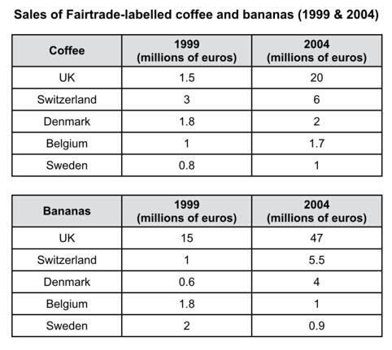
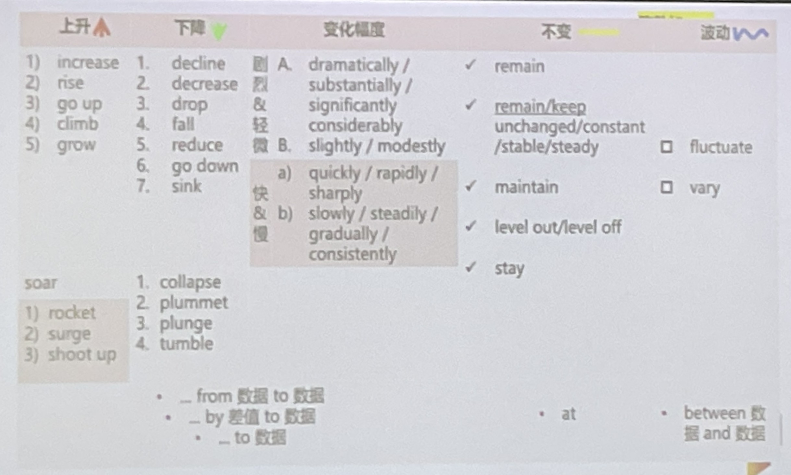
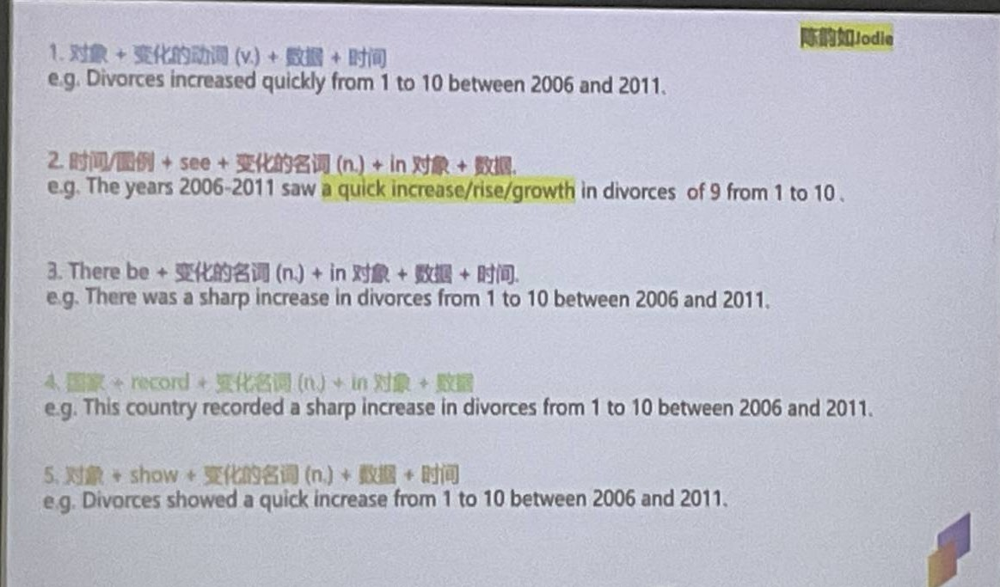

# C10T2_TASK1_coffee

## 题目

The tables below give information about sales of Fairtrade*-labelled coffee and bananas in 1999 and 2004 in five European countries.

Summarise the information by selecting and reporting the main features, and make comparisons where relevant.

*Fairtrade: a category of products for which farmers from developing countries have been paid an officially agreed fair price.

## MODEL

The two tables contain sales data for Fairtrade coffee and bananas in 1999 and 2004, in five nations of Europe.

The first table shows low-level coffee sales increasing in all five countries, **albeit to (尽管)** widely varying degrees. In two places sales increased **by the same small amount**: 1.8-2 million euros in Denmark, and 0.8-1 million in Sweden. **The increment was slightly larger** in Belgium, from 1-1.7 million euros. **Meanwhile**, in Switzerland sales doubled from 3-6 million euros. Finally, in the UK there was an enormous increase, from 1.5-20 million euros.

In the second table, it is Switzerland which stands out as buying far more Fairtrade bananas than the other four countries (强调句). **Swiss sales figures** **jumped** from 15-47 million euros across these years, while in the UK and Belgium sales only grew from 1-5.5 and from 0.6-4 million euros respectively. Sweden and Denmark showed a different pattern, with falls in banana sales from 1.8-1 and 2-0.9 million euros.

**Comparing the two tables**, it is clear that in 1999 Fairtrade coffee sales ranged from 0.8-3 million euros in these five countries, while banana sales also mostly clustered between 0.6 and 2 million euros, with Switzerland **the outlier (离群，异常，此外)** at a huge 15 million euros. By 2004, sales figures for both products had risen across the board, **except for** Sweden and Denmark which recorded drops in banana sales.

## 讲解

典型的动态图

### 写作思路

step 1

subject:

以 coffee 为例：sales of coffee in the UK / coffee sales in the UK /sales figures for coffee

tense: past tense

eg: 1999 and 2004

区分 一般过去时 和 过去完成时

Coffee sales in the UK increased to 20 in 2004. 一般过去时

Coffee sales in the UK **had** increased to 20 **by** 2004. 过去完成时

unit: million**s** of euros 百万欧元，属于**不确定**数值，注意 million 加了 s，euro 也加了 s。

确定数值 million 不加 s：

1 **million** of **euro** (**特例**)

2 million of **euros**

0.5 million of euros

1.5 million of euros

---

step 2

paragraphing, 3-5 paragraphs

types 类型: banana ; coffee (四段) （小于等于三个）

patterns 规律：increase；decrease（多于三个）

---

step 3 

In a paragraph (sequence logically)：extent; patterns

### 积累表达

albeit to (尽管) = although

the outlier (离群，异常，此外) = the exception, 类似还有 except for (除了)

## 动态图 - 总结

描述上升下降变化的词语

动态变化句式

## 关联

 [note_teacher_1.pdf](note_teacher/note_teacher_1.pdf) 

 [note_self_1.pdf](note_self/note_self_1.pdf)