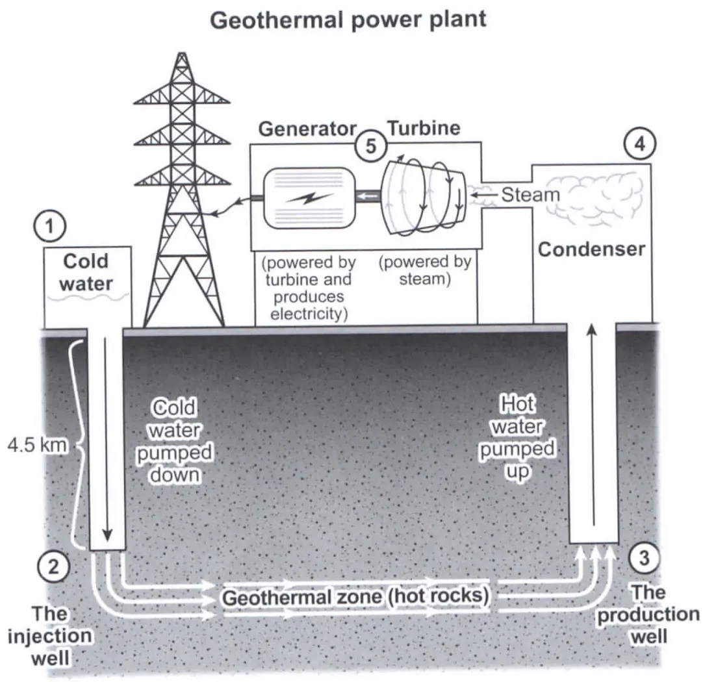

# C12T8_power_plant

## 题目

The diagram below shows how geothermal energy is used to produce electricity.

Summarise the information by selecting and reporting the main features, and make comparisons where relevant.

## 初稿

一图，三段，intro, body(steps), overview

step1, intro

The diagram illustrates how electricity is produced by geothermal energy. After about five steps of manufacturing, the electricity is transmitted to the national grid.

step2, verb

1. colder water in the tank be pumped down by the injection well
2. be heated
3. hot water be pumped up by the production well into the condenser.
4. how water turn into steam in the condenser.
5. turbine is powered by steam
6. generator is powered by turbine and produces electricity.
7. The electricity is transmitted to the national grid.

step3, overview

Overall, the geothermal power plant uses steam produced by geothermal energy to power the turbine and generator in order to produce the electricity we need.

全文：

The diagram illustrates how electricity is produced by geothermal energy. After about five steps of manufacturing, the electricity is transmitted to the national grid.

First of all, the cold water in the tank is pumped down about 4.5 km by the injection well. After that, it is heated by the hot rocks in the geothermal zone, where it turns into hot water. In the next step, the hot water is pumped up by the production well into the condenser, where it turns into steam. Afterwards, the turbine is powered by the steam. This is followed by the step in which the generator is powered by the turbine and produces electricity. Finally, the electricity can be transmitted to the national grid.

Overall, the geothermal power plant uses steam produced by geothermal energy to power the  turbine and generator in order to produce the electricity we need.

初稿感想：

- 说好的 5 步，结果图中的五步的逻辑根本不能写，还要自己整理？

- 还是写完第一遍缺字数。

## 批改

这篇完成的不错。
