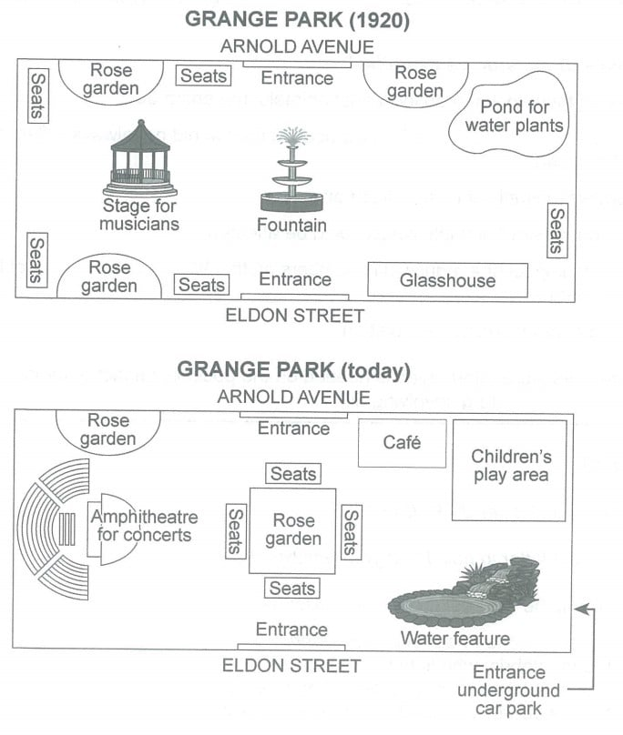

# C14T4_park_1920_today

## 题目

The plans below show a public park when it first opened in 1920 and the samepark today.

Summarise the information by selecting and reporting the main features, and make comparisons where relevant.

## MODEL

## 初稿

## 批改

TODO

## 讲解

### 1 尝试

尝试写 1920 的 fountain 和 today 的 rose garden。

- A glasshouse **was** located to the east of the entrance from Eldon Street.
  - 时态
- The fountain ~~in the centre of the park~~ was replaced by a square rose graden with seats on its four sides.
  - 时态：has been replaced by
  - Redeuce repetition
  - Fix: The fountain has been repalced by a square rose graden with seats on its four sides.

---

尝试写 1920 的 stage for musicians。

错句：A stage for musicians is at the west side of a fountain.

- **prepositions: at/in/on/to**

  - 
  - 

  - A pond for water plants was in the northeast corner of the park.

  - A stage for musicians **was to the west of the fountain**.

  - A stage for musicians was on the west side of the fountain. (e.g. coast; bank 河岸）

  - At **点的概念**：at the intersection/junction/the end of the road

- articles 冠词
  - 第一次：a/an --- 第二次：the（可数名词）
  - 第一次：无 --- 第二次：the（不可数名词）
- is -> was

最后修改为：A stage for musicians was to the west of the fountain.

---

尝试写 1920 的 glass house。

A glasshouse located to the east of the entrance from ELDON STREET.

六大句式：

1. We can find sth... + 方位
   - We can find a beach at the western end of island.
   - west 和 western 都可以，但地名中明确指出的不要改。
2. Sth can be found + 方位
   - A beach can be found at the western end of the island.
3. Sth lies/sits/stands... + 方位（主动语态 - lie/sit/stand 所描述物体由低到高）
   - 坐落 lie-lay-lay (不是撒谎)；sit-sat-stood
   - A beach lies at the western end of the island.
4. Sth is located/situated/sited... + 方位
   - A beach is located/situated/sited at the western end of the island.
5. There be + sth + 方位
   - There is a beach at the western end of the island.
6. 方位 + is/lies/sits/stands sth（倒装句，不能忘记介词！）
   - **At** the west end of the island lies a beach.

### 2 流程

1. Introduction
2. The first map (location)
3. The second map (remain + change)
4. Overview

### 3 1920's part

1) A big picture (**layout/structure**, e.g. a rectangular area) + **entrances** (on the north and south sides of park)
2) North/south/west/east --- centre/sides 方位意识
3) 同类一起说 (some seats and rose gardens were on the four edges of the park)
4) In 1920, a stage for musicians was to the west of the fountain. 已出现参照物定位未出现的；参照物清晰明确。

---

尝试写：

In 1920, the grange park was located between the Arnold avenue and Eldon street in a  rectangular area. The entrances were on the north and south sides of the park. **In the centre of the park** lay a fountain. There was a stage for musicians to the west of the fountain. A glasshouse could be found to the southeastern of the fountain, while a pond for water plants was located to the northeastern of the fountain. Five seats and three rose gardens were on the four edges of the park.

Sample:

In 1920, Grange Park was a rectangular area, **with access** from Arnold Avenue and Eldon Street on the north and south sides of the park. There was a fountain in the center, **with** a stage for musicians on its west side, a pond for water plants to the east of the north entrance and **a glasshouse in the southeast corner of park opposite**. On the four edges of the park sat some seats and rose gardens.

Cohesion:

1. , with … **简洁**。
2. 错误例子：A pond for water plants was in the northeast corner of the park. ~~The pond for water is opposite a glasshouse.~~ A glasshouse was opposite the pond for water plants.
   - 首先描述 glasshouse 的时候应该把 glasshouse 当作主语。
   - 其次 opposite 用的不准确。需要先写精准定位，然后再考虑写 opposite（sample 句子）

GRA:

1. At the center of the park lay a fountain --> **In the center of the park lay a fountain**
2. At the end of the road/at the intersection/at the junction

### 4 today's part

| 不变和变化 |                                                                 |
| ---------- | --------------------------------------------------------------- |
| 消失       | disappear                                                       |
|            | be removed, be demolished, be knocked down                      |
| 新建       | be newly built/constructed/added                                |
| 替换 (1)   | B replace A                                                     |
|            | A is replaced by B                                              |
|            | A is changed/turned into B                                      |
| 替换 (2)   | B + be constructed in the 方位名词，where A + be found/located. |
|            | B occupy the area where A stand.                                |
|            | A go and in its places be B.                                    |
|            | where A stand there be B.                                       |
| 换位置     | be relocated to sw/be moved to sw                               |
| 变大变小   | sth becomes larger/smaller                                      |
|            | sth expands/shrinks in size                                     |
|            | sth is enlarged/extended/reduced in size                        |
| 不变       | sth remains at/in ...                                           |
|            | sth remains unchanged                                           |
|            | sth is kept unchanged                                           |
