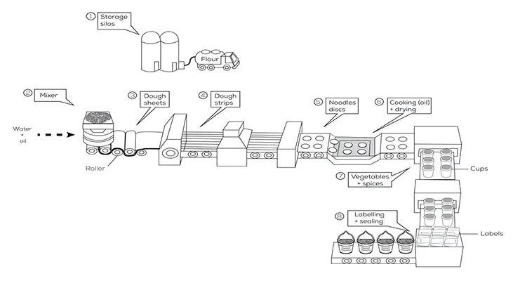
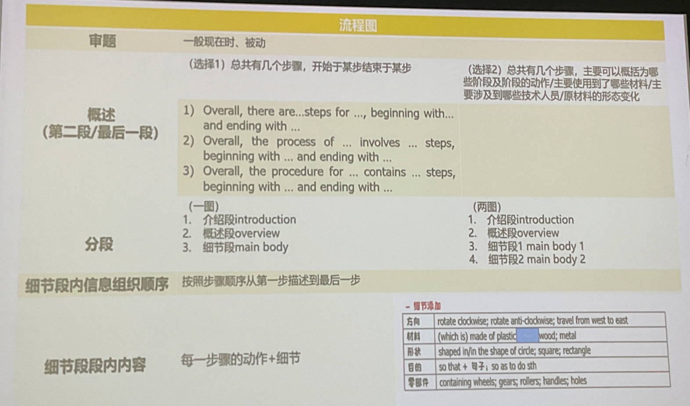

# C15T3_instant_noodles

## 题目

The diagram below shows how instant noodles are manufactured.

Summarise  the information by selecting and reporting the main features, and make comparisons where relevant.

## MODEL

SAMPLE BAND 6.5 (不算很高)

## 讲解

典型的流程图，先没按照流程讲解

### 1 动词

关注每一步的动词。(be made into sth by sth) (TA/LR)

1. Be transported/carried/shipped to sw
2. Be mixed/blended vs be stirred
   - Blend = mix（不同的内容混合）flour, water and oil are blended/mixed
   - Stir（把一个东西混进另一个东西内）flour is stirred into water and oil
3. Be rolled/stretched/flattened
4. Be cut
5. Be shaped into sth
6. Be deep fried and dried (dehydrated)
7. Be put/packaged/packed (into cups/bags)
8. Be labelled and sealed
9. Be shipped to sw/be sent to different shopping facilities

顺带提一下名词：

- material 和 ingredients，后者是能吃的原材料
  - raw materials 原材料
- mixture 混合物
- 容器...
- -er 工具名
- 加工厂 **the processing plant**/factory
- 销售地方 shopping facilities
- the round-shaped figure 圆形的物体

### 2 顺序逻辑联系手段

1. 逻辑联系词
2. 状语从句
3. 指代
4. 替代

- First,/First of all,/ To begin with; Second,/secondly; Third,/Thirdly, ...
- In the first step,; In the second step,; In the next step,; In the following step,
- ..., before...
- After..., ...
- After...days, ...
- ... . After that, ..., ... . Afterwards, ...
- ..., followed by the step in which ...
- ... . This is followed by the step in which ... .
- ... . The following step is to do sth; The following operation involves ...
- By the time ..., ...
- Once ..., ...
- 替代 substitution: substance, these products (注意容易混淆时候不要用)
- 指代 referencing words: it/they
- Whilst ..., ... (两个步骤同时发生)
- ... . At the same time, ... (两个步骤同时发生)

### 3 介绍段

- The flow chart/diagram illustrates the production of sth.
- The flow chart/diagram illustrates how sth be produced/manufactured.

### 4 其他

- Workers put the noodles into the cups --> noodles are put into the cups **一般现在时、被动**。
- The flour is shipped to a mixer where water, oil and flour are blended. 完整句子，不要祈使句。
- P47 C15T3 一图三段；P42 C6T3 两图四段；life cycle 考的少

## 流程图总结

## 初稿

The flow chart illustrates the production of instant noodles. After 8 steps of manufacturing, the products are sent to different shopping facilities.

First of all, the flour is transported from storage silos to the processing plant. Then it is fully stirred into water and oil by the mixer. After that, the mixture is rolled into dough sheets by the rollers. The sheets are then cut into strips, followed by the step in which strips are shaped into noodles discs. Afterwards, the discs are deep fried and dried. In the next step, they are packed with some vegetables and spices into cups. Finally, the cups are labelled and sealed. The instant noodles now can be delivered to the supermarkets and various groceries.

Over all, it takes a lot of efforts to provide a cup of instant noodles for customers.

初稿写作感受：

- 写完第一遍只有 138 词，不够 150 词。有点难凑句子，是要靠联系词来凑吗？

- 介绍段还要简短的提一下有多少步吧。

## 关联

- [note_teacher_5.pdf](../note_teacher/teacher_5.pdf)
- [note_teacher_6.pdf](../note_teacher/teacher_6.pdf)
- [note_self_5.pdf](../note_self/self_5.pdf)
