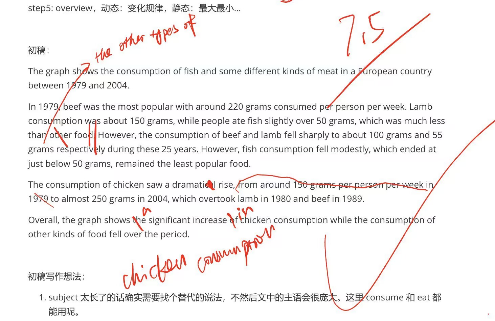

# C7T2_fish_and_meat_consumption

## 初稿

step 1:

subject: the consumption of fish and some different kind of meat / the amounts of beef, lamb, chicken, fish consumed

tense: past tense

unit: grams per person per week

step 2: paragraphing

1. by category: fish / meat
2. change: up—chicken, down—lamb, beef and fish

use 2

step 3: ...

step 4: 起点（终点），最值，整体变化...

step5: overview，动态：变化规律，静态：最大最小...

The graph shows the consumption of fish and some different kinds of meat in a European country between 1979 and 2004.

In 1979, beef was the most popular with around 220 grams consumed per person per week. Lamb consumption was about 150 grams, while people ate fish slightly over 50 grams, which was much less than other food. However, the consumption of beef and lamb fell sharply to about 100 grams and 55 grams respectively during these 25 years. However, fish consumption fell modestly, which ended at just below 50 grams, remained the least popular food.

The consumption of chicken saw a dramatical rise, from around 150 grams per person per week in 1979 to almost 250 grams in 2004, which overtook lamb in 1980 and beef in 1989.

Overall, the graph shows the significant increase of chicken consumption while the consumption of other kinds of food fell over the period.

初稿写作想法：

1. subject 太长了的话确实需要找个替代的说法，不然后文中的主语会很庞大。这里 consume 和 eat 都能用呢。

2. fish and meat：meat 可以指供食用的动物的“肉”，但是一般不指鱼肉，因为表示鱼肉有专门的词 fish。

   1. 有些动物的“肉”有相应的专用词：pork 猪肉 / beef 牛肉 / mutton 羊肉 / lamb 羔羊肉 / chicken 鸡肉

   2. 有的动物的“肉”没有相应的专用词，此时人们通常就在这种动物名称后加上 meat 来表示其“肉”：dog meat 狗肉 / horse meat 马肉 / snake meat 蛇肉
   3. 有些动物名与其相应的“肉”用同一个词表示：rabbit 兔子，兔子肉 / duck 鸭，鸭肉

这里图的标题写”fish and meat“感觉和分类没什么关系，纯粹是习惯用法不写在一起，所以不能用于 paragraphing 吧。

3. 写的时候参考了 MODEL。

   1. 虽然本来对它先写起点和变化各分了一段不太满意，但是后来发现这么写可能确实是最好的，所以模仿了。我设想的是 up—chicken, down—lamb, beef and fish 共两段，然后在 down 的那一段里，分别对 lamb/beef/fish 写起点和变化，但是后来发现这样比较啰嗦，还不如在 down 的这一段内先说这三种肉类消费的起点情况，然后再说变化。但是对于 up 段就是一句话写完起点和变化了。

   2. 交叉点的写法抄的 MODEL。

   3. overview 也像 MODEL 一样写的是动态，因为静态没有太多好说的。

## 批改

