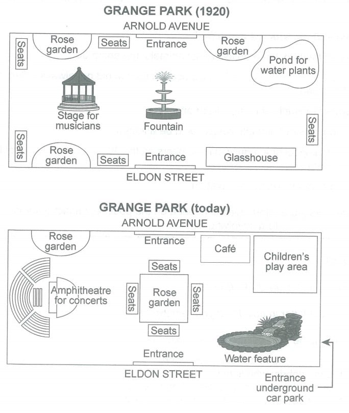
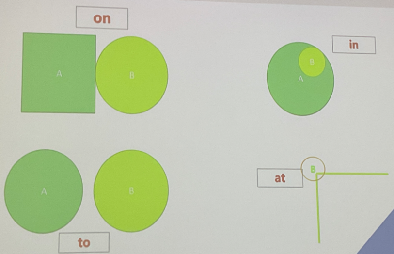
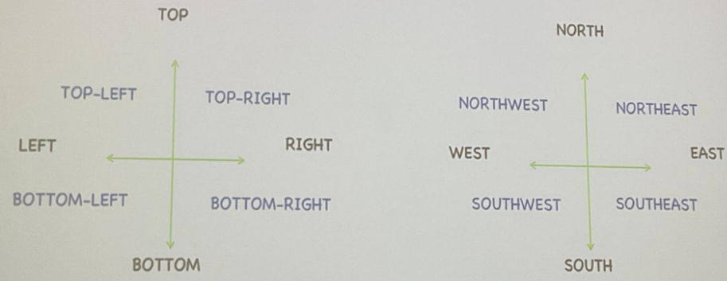

# C14T4_park_1920_today

## 题目

The plans below show a public park when it first opened in 1920 and the same park today.

Summarise the information by selecting and reporting the main features, and make comparisons where relevant.

## MODEL

Grange Park was opened in 1920, a rectangular area with access from Arnold Avenue on the north side and from Eldon Street on the south side. There was a fountain in the centre, with a stage for musicians situated centre left, a glasshouse to the right of the Eldon Street entrance and a pond for water plants in the north east corner opposite. Around the edges of the park there were rose gardens, with seats nearby for people to smell the flowers and listen to music.

The park has altered considerably since then. Now there is one largeish rose garden, occupying the central area where the fountain stood, and with seats all around it. One of the smaller rose gardens remains on the north side of the park. The bandstand (stage for musicians) has also been replaced, by an amphitheatre for concerts and associated seating. The glasshouse has gone and in its places is a water feature; **similarly**, where the pond for water plants stood there is now a children’s play area with a café nearby. Access to the park is still via the two original but there is now a third entrance near the water feature from an underground car park.

**Despite the apparently significant changes, the park retains the basic elements of flowers, water, seating and music, with the addition of a café and a children’s play area.**

## 初稿

The graphs show Grange Park when it first opened in 1920 and the same park today.

In 1920, the park was a rectangular area, with two entrances on its north and south sides, beside Arnold Avenue and Eldon Street, respectively. In the centre of the park lay a fountain, with a stage for musicians to the west, a glasshouse to the southeast, and a pond for water plants to the northeast. Five seats and three rose gardens were on the four edges of the park.

Today, the north and south entrances remain unchanged, while an entrance to an underground car park has been added in the southeastern corner of the park. The fountain has been replaced by a square rose garden with seats on all sides. The rose garden in the northeastern side of the park has been turned into a café, while the opposite one has disappeared. On the right side of the café now stands a children's play area, where the pond for water plants **used to be**. An amphitheatre for concerts has replaced the stage for musicians, and a water feature **occupies** the area where the glasshouse stood.

Overall, Grange Park has changed a lot since 1920.

初稿感想：

- 感觉知识用的还不是很熟练，可以多背然后多写几篇这个类型的？
- of the park 能省略吗？
  - 答：可以省略。

- was found 可用吗？感觉 used to be 好些？
  - 答：都可以的，没问题。

- occupy 能用完成时吗？
  - 可以，但是不能用被动。

## 批改

1. In 1920, the park was a rectangular area, with two entrances on its north and south sides, ~~beside~~ **from** Arnold Avenue and Eldon Street, respectively.

2. ~~Five~~ seats and ~~three~~ rose gardens were on the four edges of the park. -> **Some** seats and rose gardens were on the four edges of the park. 不需要具体写数字。

3.  while ~~an~~ a new entrance to an underground car park has been added in the southeastern corner of the park.

4.  ~~The rose garden in the northeastern side of the park has been turned into a café, while the opposite one has disappeared.~~ -> opposite 又用错了，作形容词时，“相反的” 是抽象的相反，而不是方位的相反。不过就算是方位也是模糊的。

    改正就看 MODEL 吧。

## 讲解

### 1 尝试

尝试写 1920 的 glasshouse 和 today 的 rose garden。

A glasshouse **was** located to the east of the entrance from Eldon Street.
- **be located**!

---

尝试写 today 的 rose garden。

错句：The fountain ~~in the centre of the park~~ was replaced by a square rose garden with seats on its four sides.
- 时态：**has been replaced by**
- Reduce repetition

修改为：The fountain has been replaced by a square rose garden with seats on its four sides.

---

尝试写 1920 的 stage for musicians。

错句：The stage for musicians is at the west side of a fountain.

- is -> was
- The stage for musicians -> A stage for musicians (第一次提到)
- a fountain -> the fountain (前面已提过)
- at the west side -> **on the west side**

修改为：A stage for musicians **was to** the west of the fountain.

或者：A stage for musicians was on the west side of the fountain.

### 2 总结

#### 2.1 prepositions: at/in/on/to

一般的：`in/on/at/to...` + `the` + ` west/western/left...` +  `of sth`.

e.g.

- A pond for water plants was in the northeast corner of the park.

- A stage for musicians **was to the west of the fountain**.

---

特殊的：

- on the side/coast/bank/edge
  - e.g. A stage for musicians was **on the west side** of the fountain.
- in the corner
  - e.g. A pond for water plants was **in the northeast corner** of the park.
- in the center
  - e.g. **In the center** of the park lay a fountain.
- At **点的概念**：at the end of the road/at the intersection/at the junction
  - e.g. We can find a beach **at the western end** of island.

#### 2.2 旁边

- A be next to/adjacent to/close to/near/beside B
- A be to/in/on the left/right/.... ([**on**] the left/right/... side/bank/coast) of B
- A be opposite B
- A be between B and C
- A be intersected with B
- A at the junction/intersection of ... and ...
- A be surrounded by B
- A, with B around it

#### 2.3 articles 冠词

- 第一次：a/an --- 第二次：the（可数名词）
- 第一次：无 --- 第二次：the（不可数名词）

#### 2.3 六大句式

1. **We can find sth... + 方位**
   - We can find a beach at the western end of island.
   - west 和 western 都可以，但地名中明确指出的不要改。
2. **Sth can be found + 方位**
   - A beach can be found at the western end of the island.
3. **Sth lies/sits/stands... + 方位**（主动语态 - lie/sit/stand 所描述物体由低到高）
   - 坐落 lie-lay-lay (不是撒谎)；sit-sat-stood
   - A beach lies at the western end of the island.
4. **Sth is located/situated/sited... + 方位**
   - A beach is located/situated/sited at the western end of the island.
5. **There be + sth + 方位**
   - There is a beach at the western end of the island.
6. **方位 + is/lies/sits/stands sth**（倒装句，不能忘记介词！）
   - **At** the west end of the island lies a beach.

#### 2.4 不变和变化

| 不变和变化 |                                                              |
| ---------- | ------------------------------------------------------------ |
| 消失       | disappear                                                    |
|            | be removed, be demolished, be knocked down                   |
| 新建       | be newly built/constructed/added                             |
| 替换 (1)   | B replace A                                                  |
|            | A is replaced by B                                           |
|            | A is changed/turned into B                                   |
| 替换 (2)   | B + be constructed in the 方位名词，where A + be found/located. |
|            | B occupy the area where A stand.                             |
|            | A go and in its places be B.                                 |
|            | where A stand there be B.                                    |
| 换位置     | be relocated to sw/be moved to sw                            |
| 变大变小   | sth becomes larger/smaller                                   |
|            | sth expands/shrinks in size                                  |
|            | sth is enlarged/extended/reduced in size                     |
| 不变       | sth remains at/in ...                                        |
|            | sth remains unchanged                                        |
|            | sth is kept unchanged                                        |

### 3 流程

1. Introduction
2. The first map (location)
3. The second map (remain + change + objects)
4. Overview (despite sth, ...; although + sentence, ... 看**侧重**变还是不变)

### 4 location 段内逻辑

1) A big picture (**layout/structure**, e.g. a rectangular area) + **entrances** (on the north and south sides of park)
2) North/south/west/east --- centre/sides 方位意识
3) 同类一起说 (some seats and rose gardens were on the four edges of the park)
4) In 1920, a stage for musicians was to the west of the fountain. 已出现参照物定位未出现的；参照物清晰明确。

---

尝试写 1920，Sample:

In 1920, Grange Park was a rectangular area, **with access** from Arnold Avenue and Eldon Street on the north and south sides of the park. There was a fountain in the center, **with** a stage for musicians on its west side, a pond for water plants to the east of the north entrance and **a glasshouse in the southeast corner of park opposite**. On the four edges of the park sat some seats and rose gardens.

Cohesion:

1. , with … **简洁**。
2. 错误例子：A pond for water plants was in the northeast corner of the park. ~~The pond for water is opposite a glasshouse.~~ A glasshouse was opposite the pond for water plants.
   - 首先描述 glasshouse 的时候应该把 glasshouse 当作主语。
   - 其次 opposite 用的不准确。需要先写精准定位，然后再考虑写 opposite（sample 句子）

GRA:

1. At the center of the park lay a fountain --> **In the center of the park lay a fountain**
2. At the end of the road/at the intersection/at the junction
3. access 用于替换 entrance，后接 from/to
